# Machine Learning Engineer Nanodegree

## Capstone Project - NotPineapple

*Paresh Pradhan*  
*May 21st, 2018*

## I. Definition

### Project Overview

**Overview** - This project is a binary (2-class) image classification project. Given an input image of a fruit, it determines whether that fruit is a Pineapple or not and with what probability. Or Given multiple testing images, it calculates the accuracy of the model correctly predicting whether the fruit is Pineapple or not. The models will be created using Python's Keras library with Tensorflow backend.

**Image Classification** - It is the task of assigning an input image one label from a fixed set of categories. This is one of the core problems in Computer Vision that, despite its simplicity, has a large variety of practical applications. Many other Computer Vision tasks such as object detection and/or segmentation can be reduced to image classification.

**Data-driven approach** - Unlike writing an algorithm for, for example, sorting a list of numbers, it is not obvious how one might write an algorithm for identifying cats in images. Therefore, instead of trying to specify what every one of the categories of interest look like directly in code, we’re going to provide the computer with many examples of each class and then develop learning algorithms that look at these examples and learn about the visual appearance of each class. This approach is referred to as a data-driven approach, since it relies on first accumulating a training dataset of labeled images.

**Image classification pipeline** - The task in Image Classification is to take an array of pixels that represents a single image and assign a label to it. Our complete pipeline can be formalized as follows:

- Input: Our input consists of a set of N images, each labeled with one of K different classes. We refer to this data as the training set.
- Learning: Our task is to use the training set to learn what every one of the classes looks like. We refer to this step as training a classifier, or learning a model.
- Evaluation: In the end, we evaluate the quality of the classifier by asking it to predict labels for a new set of images that it has never seen before. We will then compare the true labels of these images to the ones predicted by the classifier. Intuitively, we’re hoping that a lot of the predictions match up with the true answers (which we call the ground truth).

**Convolutional Neural Networks (ConvNet)** - They are very similar to ordinary Neural Networks. They are made up of neurons that have learnable weights and biases. Each neuron receives some inputs, performs a dot product and optionally follows it with a non-linearity. The whole network still expresses a single differentiable score function: from the raw image pixels on one end to class scores at the other. And they still have a loss function (e.g. SVM/Softmax) on the last (fully-connected) layer and all the tips/tricks for learning regular Neural Networks still apply.

So what does change? ConvNet architectures make the explicit assumption that the inputs are images, which allows us to encode certain properties into the architecture. These then make the forward function more efficient to implement and vastly reduce the amount of parameters in the network. [1]

**Personal Motivation** - This project was inspired from the following:

- NotHotdog app shown in the popular TV series - Silicon Valley [2]
- NotSanta project by Adrian Rosebrock [3]

### Problem Statement

We are trying to decide that given an input image of a fruit, whether that fruit is a Pineapple or Not.

#### Input

The input dataset used in this project was sourced from the Fruits-360 dataset on Kaggle [4].

The dataset has been zipped into a single file - *Training\_Testing\_Images.zip*

The contents of the file are as follows:

- *Training_Images*
  - *Pineapple* - 490 images (100x100 pixels) taken directly from the Fruits-360/Training directory
  - *NotPineapple* - 490 images (100x100 pixels) randomly selected from all other fruits in the Fruits-360/Training directory
- *Testing_Images*
  - *Pineapple* - 166 images (100x100 pixels) taken directly from the Fruits-360/Validation directory
  - *NotPineapple* - 166 images (100x100 pixels) randomly selected from all other fruits in the Fruits-360/Validation directory

The images were extracted from the Fruits-360 dataset using shell commands. All images are 100x100 jpg images.

#### Pre-Processing

Each image is resized into 3 image sizes before passing through the model:

- 25x25 pixels
- 50x50 pixels
- 100x100 pixels

We also the pass the image through Keras' Image Augmentation module to generate variations of the image.

#### Model

We will use 3 different neural-network models to try and classify the images into Pineapple and NotPineapple categories:

- Fully connected Neural Network
- Custom Convolutional Neural Network
- Convolutional Neural Network using the LeNet architecture

Thus we have 9 combinations of **input image size** X **model type** for which we need to calculate and compare prediction accuracies.

#### Output

We have two types of output:

1. Single-image output - One output image with the prediction accuracy.
2. Full testing output - A csv file that contains the accuracy data for all the models which ran over all tesing images.

### Metrics

We are doing a binary classification with input data having equal number of samples for both classes. Hence, **Prediction Accuracy** should be sufficient as a Metric.

Here we define Prediction Accuracy as:

$$ accuracy = \frac { Number\ of\ matches\ between\ predicted\ labels\ and\ true\ labels }{ Number\ of\ input\ images } $$

## II. Analysis

### Data Exploration

The Training and Testing images were sourced from Fruits-360 dataset at Kaggle [4]. They were created by following the steps mentioned in the *create_notpineapple_image_dataset.md* file.

The original Fruits-360 dataset contained following fruits: Apples - (different varieties: Golden, Golden-Red, Granny Smith, Red, Red Delicious), Apricot, Avocado, Avocado ripe, Banana (Yellow, Red), Cactus fruit, Carambula, Cherry, Clementine, Cocos, Dates, Granadilla, Grape (Pink, White, White2), Grapefruit (Pink, White), Guava, Huckleberry, Kiwi, Kaki, Kumsquats, Lemon (normal, Meyer), Lime, Litchi, Mandarine, Mango, Maracuja, Nectarine, Orange, Papaya, Passion fruit, Peach, Pepino, Pear (different varieties, Abate, Monster, Williams), Pineapple, Pitahaya Red, Plum, Pomegranate, Quince, Raspberry, Salak, Strawberry, Tamarillo, Tangelo.

#### Extracted Dataset

We have two classes of training and testing images - Pineapple and NotPineapple. Each class has 490 training images and 166 testing images. All images are RGB and have shape 100x100.

The dataset has the following structure:

- *Training_Images*
  - *Pineapple* - 490 images (100x100 pixels) taken directly from the Fruits-360/Training directory
  - *NotPineapple* - 490 images (100x100 pixels) randomly selected from all other fruits in the Fruits-360/Training directory
- *Testing_Images*
  - *Pineapple* - 166 images (100x100 pixels) taken directly from the Fruits-360/Validation directory
  - *NotPineapple* - 166 images (100x100 pixels) randomly selected from all other fruits in the Fruits-360/Validation directory

#### Samples

Samples of the Pineapple class:

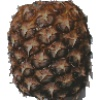
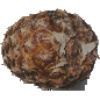
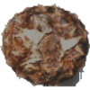
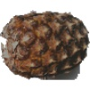
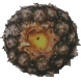

Samples of the NotPineapple class:

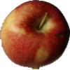
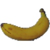
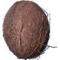
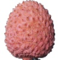
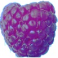

There are a total of 60 different fruits including Pineapple (Different varities of the same Fruit have been classfied as a separate fruit).

### Exploratory Visualization

#### Distribution

The distribution of labels - Pineapple and NotPineapple, for Training and Testing images in the dataset is shown below. As can be seen in the plot below, the Training Images have 490 images each for both Pineapple and Not Pineapple labels and the Testing Images have 166 images for each label. Hence, there is no class imbalance issue.

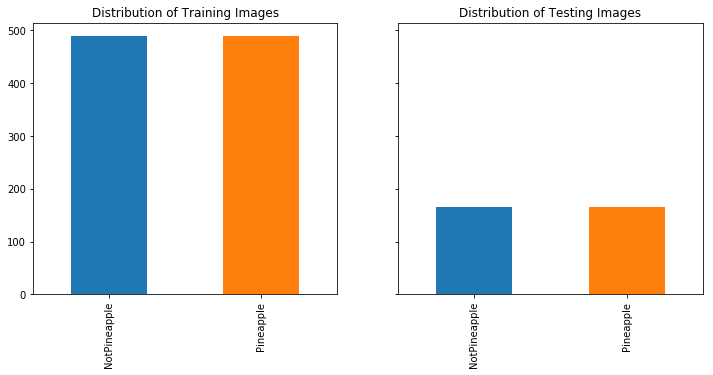

### Algorithms and Techniques

We will use 3 different neural-network models to try and classify the images into Pineapple and NotPineapple categories:

#### 1. Fully Connected Neural Network

Fully Connected Neural Networks receive an input (a single vector), and transform it through a series of hidden layers. Each hidden layer is made up of a set of neurons, where each neuron is fully connected to all neurons in the previous layer, and where neurons in a single layer function completely independently and do not share any connections. The last fully-connected layer is called the “output layer” and in classification settings it represents the class scores. [1]

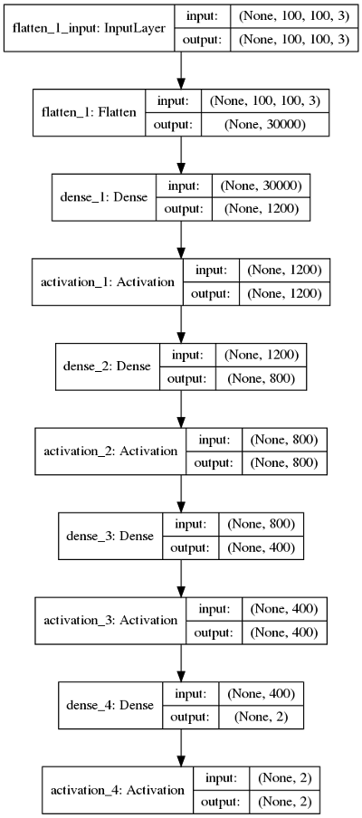

#### 2. Convolutional Neural Network - Custom architecture

As mentioned before, Convolutional Neural Networks are very similar to ordinary Fully Connected Neural Networks. ConvNet architectures make the explicit assumption that the inputs are images, which allows us to encode certain properties into the architecture. These then make the forward function more efficient to implement and vastly reduce the amount of parameters in the network. [1]

This second model is a custom implementation of a Convolutional Neural Network.

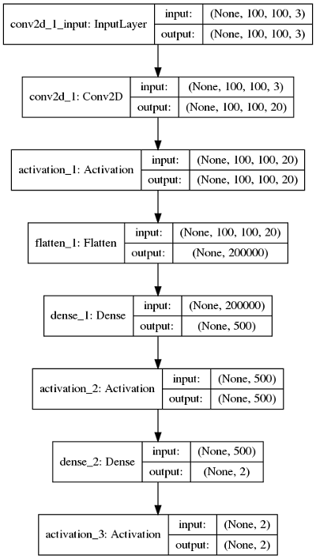

#### 3. Convolutional Neural Network - LeNet architecture

The first successful applications of Convolutional Networks were developed by Yann LeCun in 1990’s. Of these, the best known is the LeNet architecture that was used to read zip codes, digits, etc. [1]

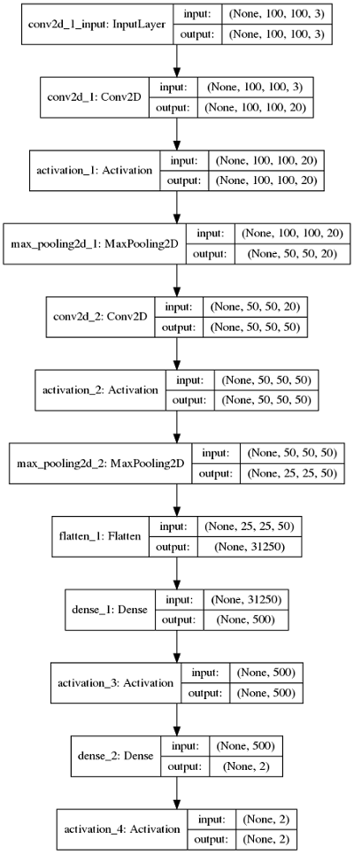

#### Types of Neural Network Layers

**Input Layer** - This is the first layer of the model. It has shape - (Batch Size, Image Width, Image Height, Number of Channels)

**Convolution Layer** - The convolutional layer is the core building block of a CNN. The layer's parameters consist of a set of learnable filters (or kernels), which have a small receptive field, but extend through the full depth of the input volume. During the forward pass, each filter is convolved across the width and height of the input volume, computing the dot product between the entries of the filter and the input and producing a 2-dimensional activation map of that filter. As a result, the network learns filters that activate when it detects some specific type of feature at some spatial position in the input.

Stacking the activation maps for all filters along the depth dimension forms the full output volume of the convolution layer. Every entry in the output volume can thus also be interpreted as an output of a neuron that looks at a small region in the input and shares parameters with neurons in the same activation map. [5]

It has shape - (Batch Size, Image Width, Image Height, Depth - Number of Filters)

**Activation** - The activation function of a node defines the output of that node given an input or set of inputs. We have used the ReLU function as our activation function. ReLU is the abbreviation of Rectified Linear Units. This layer applies the non-saturating activation function $f(x)=\max(0,x)$.

**Max Pooling Layer** - It is a form of non-linear down-sampling. It partitions the input image into a set of non-overlapping rectangles and, for each such sub-region, outputs the maximum. The intuition is that the exact location of a feature is less important than its rough location relative to other features. The pooling layer serves to progressively reduce the spatial size of the representation, to reduce the number of parameters and amount of computation in the network, and hence to also control overfitting. It is common to periodically insert a pooling layer between successive convolutional layers in a CNN architecture. [5]

**Flatten** - This layer simply flattens the input tensor into a single dimension (2 dimensions if batch size is included).

**Fully Connected / Dense Layer** - As mentioned before, a fully connected layer is connected to all nodes of previes layer.

### Benchmark

We have used Predicion Accuracy as our metric. Since this is a binary classification problem, just random selection gives us 50% accuracy. So we will be using **50% Prediction Accuracy** as our benchmark to compare the different models.

We will see later that some our worst performing models give us an accuracy of roughly 50%.

## III. Methodology

### Data Preprocessing

The images were taken from a clean dataset and the image selection was done in such a way that no class imbalance problem exists.

The steps taken for pre-processing are:

- **Image Resizing** - The images are resized into three different sizes before being fed to the models:
  - 25x25
  - 50x50
  - 100x100 (original size)
- **Image Intensity Scaling** - The image intensities were scaled to range [0,1].
- **Image Augmentation** - The images are passed through the image augmentation module of Keras library before being fed to the model. The following modifications are done to the images during augmentation:
  - rotation
  - width shift
  - height shift
  - shearing
  - zooming / shrinking
  - channel shift
  - horizontal flip
  - vertical flip
  - filling
- **One-Hot-Encode the Labels** - Pineapple and NotPineapple

### Implementation

The implementation pipeline is shown in the below flowcharts [6].

#### Training

#### Testing - Single Image

#### Testing - Full

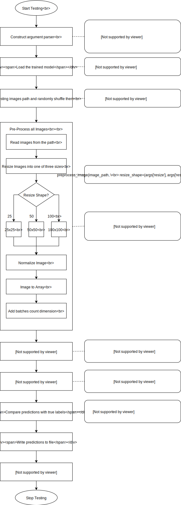

### Refinement

Different parameters were tuned to get the final results:

- Epochs - Different number of epochs were tested - 20, 25, 30 & 35
- Learning Rate - Different learning rates were tested - 1e-3, 1e-4, 1e-5
- Batch Size - Different batch sizes were tested - 32, 64, 128, 256
- Image Resize - Different image sizes were tested - 25, 28, 50, 64, 100
- Model Layers - Different number of layers were tested in the models

## IV. Results
_(approx. 2-3 pages)_

### Model Evaluation and Validation
In this section, the final model and any supporting qualities should be evaluated in detail. It should be clear how the final model was derived and why this model was chosen. In addition, some type of analysis should be used to validate the robustness of this model and its solution, such as manipulating the input data or environment to see how the model’s solution is affected (this is called sensitivity analysis). Questions to ask yourself when writing this section:
- _Is the final model reasonable and aligning with solution expectations? Are the final parameters of the model appropriate?_
- _Has the final model been tested with various inputs to evaluate whether the model generalizes well to unseen data?_
- _Is the model robust enough for the problem? Do small perturbations (changes) in training data or the input space greatly affect the results?_
- _Can results found from the model be trusted?_

### Justification
In this section, your model’s final solution and its results should be compared to the benchmark you established earlier in the project using some type of statistical analysis. You should also justify whether these results and the solution are significant enough to have solved the problem posed in the project. Questions to ask yourself when writing this section:
- _Are the final results found stronger than the benchmark result reported earlier?_
- _Have you thoroughly analyzed and discussed the final solution?_
- _Is the final solution significant enough to have solved the problem?_

## V. Conclusion
_(approx. 1-2 pages)_

### Free-Form Visualization
In this section, you will need to provide some form of visualization that emphasizes an important quality about the project. It is much more free-form, but should reasonably support a significant result or characteristic about the problem that you want to discuss. Questions to ask yourself when writing this section:
- _Have you visualized a relevant or important quality about the problem, dataset, input data, or results?_
- _Is the visualization thoroughly analyzed and discussed?_
- _If a plot is provided, are the axes, title, and datum clearly defined?_

### Reflection
In this section, you will summarize the entire end-to-end problem solution and discuss one or two particular aspects of the project you found interesting or difficult. You are expected to reflect on the project as a whole to show that you have a firm understanding of the entire process employed in your work. Questions to ask yourself when writing this section:
- _Have you thoroughly summarized the entire process you used for this project?_
- _Were there any interesting aspects of the project?_
- _Were there any difficult aspects of the project?_
- _Does the final model and solution fit your expectations for the problem, and should it be used in a general setting to solve these types of problems?_

### Improvement
In this section, you will need to provide discussion as to how one aspect of the implementation you designed could be improved. As an example, consider ways your implementation can be made more general, and what would need to be modified. You do not need to make this improvement, but the potential solutions resulting from these changes are considered and compared/contrasted to your current solution. Questions to ask yourself when writing this section:
- _Are there further improvements that could be made on the algorithms or techniques you used in this project?_
- _Were there algorithms or techniques you researched that you did not know how to implement, but would consider using if you knew how?_
- _If you used your final solution as the new benchmark, do you think an even better solution exists?_

-----------

## VI. References

[1] Stanford CS231n: Convolutional Neural Networks for Visual Recognition - <http://cs231n.github.io/>  
[2] Wikipedia - Silicon Valley - <https://en.wikipedia.org/wiki/Silicon_Valley_(TV_series)>  
[3] Adrian Rosebrock - <https://www.pyimagesearch.com/2017/12/11/image-classification-with-keras-and-deep-learning/>  
[4] Kaggle - Fruits-360 dataset - <https://www.kaggle.com/moltean/fruits>  
[5] Wikipedia - Convolutional Neural Networks - <https://en.wikipedia.org/wiki/Convolutional_neural_network>  
[6] Drawings - <https://www.draw.io/>

-----------

**Before submitting, ask yourself. . .**

- Does the project report you’ve written follow a well-organized structure similar to that of the project template?
- Is each section (particularly **Analysis** and **Methodology**) written in a clear, concise and specific fashion? Are there any ambiguous terms or phrases that need clarification?
- Would the intended audience of your project be able to understand your analysis, methods, and results?
- Have you properly proof-read your project report to assure there are minimal grammatical and spelling mistakes?
- Are all the resources used for this project correctly cited and referenced?
- Is the code that implements your solution easily readable and properly commented?
- Does the code execute without error and produce results similar to those reported?
