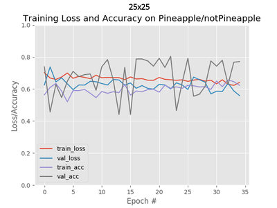
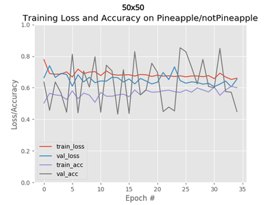
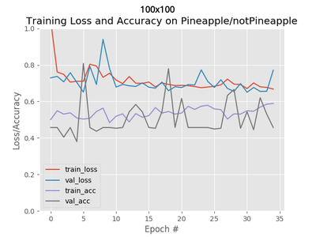
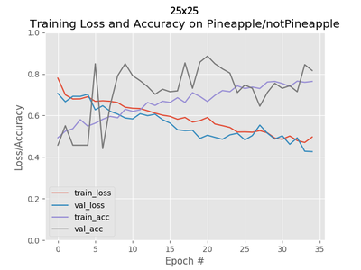
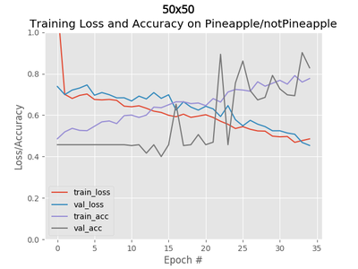

# Machine Learning Engineer Nanodegree

## Capstone Project - NotPineapple

*Paresh Pradhan*  
*May 21st, 2018*

## I. Definition

### Project Overview

**Overview** - This project is a binary (2-class) image classification project. Given an input image of a fruit, it determines whether that fruit is a Pineapple or not and with what probability. Or Given multiple testing images, it calculates the accuracy of the model correctly predicting whether the fruit is Pineapple or not. The models will be created using Python's Keras library with Tensorflow backend.

**Image Classification** - It is the task of assigning an input image one label from a fixed set of categories. This is one of the core problems in Computer Vision that, despite its simplicity, has a large variety of practical applications. Many other Computer Vision tasks such as object detection and/or segmentation can be reduced to image classification.

**Data-driven approach** - Unlike writing an algorithm for, for example, sorting a list of numbers, it is not obvious how one might write an algorithm for identifying cats in images. Therefore, instead of trying to specify what every one of the categories of interest look like directly in code, we’re going to provide the computer with many examples of each class and then develop learning algorithms that look at these examples and learn about the visual appearance of each class. This approach is referred to as a data-driven approach, since it relies on first accumulating a training dataset of labeled images.

**Image classification pipeline** - The task in Image Classification is to take an array of pixels that represents a single image and assign a label to it. Our complete pipeline can be formalized as follows:

- Input: Our input consists of a set of N images, each labeled with one of K different classes. We refer to this data as the training set.
- Learning: Our task is to use the training set to learn what every one of the classes looks like. We refer to this step as training a classifier, or learning a model.
- Evaluation: In the end, we evaluate the quality of the classifier by asking it to predict labels for a new set of images that it has never seen before. We will then compare the true labels of these images to the ones predicted by the classifier. Intuitively, we’re hoping that a lot of the predictions match up with the true answers (which we call the ground truth).

**Convolutional Neural Networks (ConvNet)** - They are very similar to ordinary Neural Networks. They are made up of neurons that have learnable weights and biases. Each neuron receives some inputs, performs a dot product and optionally follows it with a non-linearity. The whole network still expresses a single differentiable score function: from the raw image pixels on one end to class scores at the other. And they still have a loss function (e.g. SVM/Softmax) on the last (fully-connected) layer and all the tips/tricks for learning regular Neural Networks still apply.

So what does change? ConvNet architectures make the explicit assumption that the inputs are images, which allows us to encode certain properties into the architecture. These then make the forward function more efficient to implement and vastly reduce the amount of parameters in the network. [1]

**Personal Motivation** - This project was inspired from the following:

- NotHotdog app shown in the popular TV series - Silicon Valley [2]
- NotSanta project by Adrian Rosebrock [3]

### Problem Statement

We are trying to decide that given an input image of a fruit, whether that fruit is a Pineapple or Not.

#### Input

The input dataset used in this project was sourced from the Fruits-360 dataset on Kaggle [4].

The dataset has been zipped into a single file - *Training\_Testing\_Images.zip*

The contents of the file are as follows:

- *Training_Images*
  - *Pineapple* - 490 images (100x100 pixels) taken directly from the Fruits-360/Training directory
  - *NotPineapple* - 490 images (100x100 pixels) randomly selected from all other fruits in the Fruits-360/Training directory
- *Testing_Images*
  - *Pineapple* - 166 images (100x100 pixels) taken directly from the Fruits-360/Validation directory
  - *NotPineapple* - 166 images (100x100 pixels) randomly selected from all other fruits in the Fruits-360/Validation directory

The images were extracted from the Fruits-360 dataset using shell commands. All images are 100x100 jpg images.

#### Pre-Processing

Each image is resized into 3 image sizes before passing through the model:

- 25x25 pixels
- 50x50 pixels
- 100x100 pixels

We also the pass the image through Keras' Image Augmentation module to generate variations of the image.

#### Model

We will use 3 different neural-network models to try and classify the images into Pineapple and NotPineapple categories:

- Fully connected Neural Network
- Custom Convolutional Neural Network
- Convolutional Neural Network using the LeNet architecture

Thus we have 9 combinations of **input image size** X **model type** for which we need to calculate and compare prediction accuracies.

#### Output

We have two types of output:

1. Single-image output - One output image with the prediction accuracy.
2. Full testing output - A csv file that contains the accuracy data for all the models which ran over all testing images.

### Metrics

We are doing a binary classification with input data having equal number of samples for both classes. Hence, **Prediction Accuracy** should be sufficient as a Metric.

Here we define Prediction Accuracy as:

$$ accuracy = \frac { Number\ of\ matches\ between\ predicted\ labels\ and\ true\ labels }{ Number\ of\ input\ images } $$

## II. Analysis

### Data Exploration

The Training and Testing images were sourced from Fruits-360 dataset at Kaggle [4]. They were created by following the steps mentioned in the *create_notpineapple_image_dataset.md* file.

The original Fruits-360 dataset contained following fruits: Apples - (different varieties: Golden, Golden-Red, Granny Smith, Red, Red Delicious), Apricot, Avocado, Avocado ripe, Banana (Yellow, Red), Cactus fruit, Carambula, Cherry, Clementine, Cocos, Dates, Granadilla, Grape (Pink, White, White2), Grapefruit (Pink, White), Guava, Huckleberry, Kiwi, Kaki, Kumsquats, Lemon (normal, Meyer), Lime, Litchi, Mandarine, Mango, Maracuja, Nectarine, Orange, Papaya, Passion fruit, Peach, Pepino, Pear (different varieties, Abate, Monster, Williams), Pineapple, Pitahaya Red, Plum, Pomegranate, Quince, Raspberry, Salak, Strawberry, Tamarillo, Tangelo.

#### Extracted Dataset

We have two classes of training and testing images - Pineapple and NotPineapple. Each class has 490 training images and 166 testing images. All images are RGB and have shape 100x100.

The dataset has the following structure:

- *Training_Images*
  - *Pineapple* - 490 images (100x100 pixels) taken directly from the Fruits-360/Training directory
  - *NotPineapple* - 490 images (100x100 pixels) randomly selected from all other fruits in the Fruits-360/Training directory
- *Testing_Images*
  - *Pineapple* - 166 images (100x100 pixels) taken directly from the Fruits-360/Validation directory
  - *NotPineapple* - 166 images (100x100 pixels) randomly selected from all other fruits in the Fruits-360/Validation directory

#### Samples

Samples of the Pineapple class:

Samples of the NotPineapple class:

There are a total of 60 different fruits including Pineapple (Different varieties of the same Fruit have been classified as a separate fruit).

### Exploratory Visualization

#### Distribution

The distribution of labels - Pineapple and NotPineapple, for Training and Testing images in the dataset is shown below. As can be seen in the plot below, the Training Images have 490 images each for both Pineapple and Not Pineapple labels and the Testing Images have 166 images for each label. Hence, there is no class imbalance issue.

### Algorithms and Techniques

We will use 3 different neural-network models to try and classify the images into Pineapple and NotPineapple categories:

#### 1. Fully Connected Neural Network

Fully Connected Neural Networks receive an input (a single vector), and transform it through a series of hidden layers. Each hidden layer is made up of a set of neurons, where each neuron is fully connected to all neurons in the previous layer, and where neurons in a single layer function completely independently and do not share any connections. The last fully-connected layer is called the “output layer” and in classification settings it represents the class scores. [1]

#### 2. Convolutional Neural Network - Custom architecture

As mentioned before, Convolutional Neural Networks are very similar to ordinary Fully Connected Neural Networks. ConvNet architectures make the explicit assumption that the inputs are images, which allows us to encode certain properties into the architecture. These then make the forward function more efficient to implement and vastly reduce the amount of parameters in the network. [1]

This second model is a custom implementation of a Convolutional Neural Network.

#### 3. Convolutional Neural Network - LeNet architecture

The first successful applications of Convolutional Networks were developed by Yann LeCun in 1990’s. Of these, the best known is the LeNet architecture that was used to read zip codes, digits, etc. [1]

#### Types of Neural Network Layers

**Input Layer** - This is the first layer of the model. It has shape - (Batch Size, Image Width, Image Height, Number of Channels)

**Convolution Layer** - The convolutional layer is the core building block of a CNN. The layer's parameters consist of a set of learnable filters (or kernels), which have a small receptive field, but extend through the full depth of the input volume. During the forward pass, each filter is convolved across the width and height of the input volume, computing the dot product between the entries of the filter and the input and producing a 2-dimensional activation map of that filter. As a result, the network learns filters that activate when it detects some specific type of feature at some spatial position in the input.

Stacking the activation maps for all filters along the depth dimension forms the full output volume of the convolution layer. Every entry in the output volume can thus also be interpreted as an output of a neuron that looks at a small region in the input and shares parameters with neurons in the same activation map. [5]

It has shape - (Batch Size, Image Width, Image Height, Depth - Number of Filters)

**Activation** - The activation function of a node defines the output of that node given an input or set of inputs. We have used the ReLU function as our activation function. ReLU is the abbreviation of Rectified Linear Units. This layer applies the non-saturating activation function $f(x)=\max(0,x)$.

**Max Pooling Layer** - It is a form of non-linear down-sampling. It partitions the input image into a set of non-overlapping rectangles and, for each such sub-region, outputs the maximum. The intuition is that the exact location of a feature is less important than its rough location relative to other features. The pooling layer serves to progressively reduce the spatial size of the representation, to reduce the number of parameters and amount of computation in the network, and hence to also control overfitting. It is common to periodically insert a pooling layer between successive convolutional layers in a CNN architecture. [5]

**Flatten** - This layer simply flattens the input tensor into a single dimension (2 dimensions if batch size is included).

**Fully Connected / Dense Layer** - As mentioned before, a fully connected layer is connected to all nodes of previous layer.

### Benchmark

We have used Prediction Accuracy as our metric. Since this is a binary classification problem, just random selection gives us 50% accuracy. So we will be using **50% Prediction Accuracy** as our benchmark to compare the different models.

We will see later that some our worst performing models give us an accuracy of roughly 50%.

## III. Methodology

### Data Preprocessing

The images were taken from a clean dataset and the image selection was done in such a way that no class imbalance problem exists.

The steps taken for pre-processing are:

- **Image Resizing** - The images are resized into three different sizes before being fed to the models:
  - 25x25
  - 50x50
  - 100x100 (original size)
- **Image Intensity Scaling** - The image intensities were scaled to range [0,1].
- **Image Augmentation** - The images are passed through the image augmentation module of Keras library before being fed to the model. The following modifications are done to the images during augmentation:
  - rotation
  - width shift
  - height shift
  - shearing
  - zooming / shrinking
  - channel shift
  - horizontal flip
  - vertical flip
  - filling
- **One-Hot-Encode the Labels** - Pineapple and NotPineapple

### Implementation

The implementation pipeline is shown in the below flowcharts [6].

#### Training

The steps followed during training the models are shown below.

#### Testing - Single Image

The steps followed during testing a single image are shown below.

#### Testing - Full

The steps followed during testing all images are shown below.

### Refinement

Different parameters were tuned to get the final results:

- Epochs - Different number of epochs were tested - 20, 25, 30 & 35
- Learning Rate - Different learning rates were tested - 1e-3, 1e-4, 1e-5
- Batch Size - Different batch sizes were tested - 32, 64, 128, 256
- Image Resize - Different image sizes were tested - 25, 28, 50, 64, 100
- Model Layers - Different number of layers were tested in the models

## IV. Results

### Model Evaluation and Validation

The three models for all three sizes and corresponding accuracy values are as follows:

| index | model_name                      | testing_accuracy | architecture | resize  | pixels |
|-------|---------------------------------|------------------|--------------|---------|--------|
| 0     | NotPineapple_LeNet_25x25        | 0.861446         | LeNet        | 25x25   | 25     |
| 1     | NotPineapple_FullConn_25x25     | 0.533133         | FullConn     | 25x25   | 25     |
| 2     | NotPineapple_CustomConv_25x25   | 0.656627         | CustomConv   | 25x25   | 25     |
| 3     | NotPineapple_LeNet_50x50        | 0.966867         | LeNet        | 50x50   | 50     |
| 4     | NotPineapple_FullConn_50x50     | 0.484940         | FullConn     | 50x50   | 50     |
| 5     | NotPineapple_CustomConv_50x50   | 0.780120         | CustomConv   | 50x50   | 50     |
| 6     | NotPineapple_LeNet_100x100      | 0.978916         | LeNet        | 100x100 | 100    |
| 7     | NotPineapple_FullConn_100x100   | 0.463855         | FullConn     | 100x100 | 100    |
| 8     | NotPineapple_CustomConv_100x100 | 0.680723         | CustomConv   | 100x100 | 100    |

Here we can see that for all three image sizes - 25x25, 50x50 & 100x100, the LeNet architecture models have the best accuracy, followed by CustomConv. This is the expected output considering the fact that LeNet architecture is the most complex of the three architectures.

This can also seen the in below single image outputs:

#### FullConn - 25x25, 50x50, 100x100

#### CustomConv - 25x25, 50x50, 100x100

#### LeNet - 25x25, 50x50, 100x100

### Justification

The benchmark model for this project was random selection between two labels. Thus the benchmark accuracy was 50%.

In the above plot, the horizontal line represents the benchmark. As we can see, the two convolutional neural networks - LeNet and CustomConv, consistently beat the benchmark by sufficient margins. But the only time FullConn manages to beat the benchmark is when the image size is smallest (25x25).

This is the expected result. Since we are working with image data, convolutional neural networks vastly outperform fully connected neural networks (especially as image size increases). The only time Fully connected networks performs anywhere nearly as good as convnets is for the smallest image size(25x25). This can be explained by the relatively small number of input data points (625). But as the image size increases, the fully connected network fails to even beat the benchmark model of random selection.

We can also see that the more complex LeNet architecture model consistently outperforms the less complex CustomConv architecture model. While more complex models may not always lead to better results, in the context of this project, it does.

One thing we have not taken into consideration during this project is the time and resources needed to run the models. Sometimes, even when the more complex model can produce better results, it may not be used because it takes too much time or larger amounts of resources to compute.

## V. Conclusion

### Free-Form Visualization

The plots below show the following for the model training:

- Training Loss
- Validation Loss
- Training Accuracy
- Validation Accuracy

#### FullConn

For FullConn we can see that only 100x100 image has some kind of trend. The other two are mostly random.

#### CustomConv

For CustomConv the trends are more visible in al three. Training Loss and Validation Loss are constantly decreasing. And Training Accuracy and Validation Accuracy are constantly increasing. But we don't see any pattern between the three.

#### LeNet

For LeNet the trends are even more obvious. And we also see an interesting pattern across image sizes -- as the image size increases, the model converges sooner (less number of epochs).

This pattern may be because as the image size decreases, the model finds it harder to detect the image features that differentiate the fruits from each other.

### Reflection

In this project, the objective was to take images of multiple fruits and determine if any given image was a Pineapple or not. We trained nine different models -- three architectures - FullConn, CustomConv & LeNet, each with three different image sizes - 25x25, 50x50 & 100x100. Then we ran the models over a set of testing images and calculated the accuracy score for each model. By comparing the accuracies against the benchmark and against each other we determine that LeNet architecture performs best for all three image sizes.

The interesting aspect of this project is that, with a few small changes, we can use this project to classify any two image classes. The project can also be extended for multi-class classification.

The difficult part of the project was learning how to divide the scripts into classes and functions and execute parameterized scripts. Another difficulty was finding the right parameters to get the correct output.

### Improvement

The following improvements can be made to the project:

1. The project was created as a binary classification project. We can use the complete original fruits-360 dataset to do a multi-class classification instead. But, in that case, we would need better and more complex models as out of three models used here, only LeNet might give decent results.

2. The current project takes ~10 minutes to run on Nvidia 1050Ti GPU. As the project was created in a modular and parameterized fashion, a lot of time is lost in initializing the GPU modules for all 9 different model, each having a training and 2 testing scripts. This time may be reduced if the project is re-structured by removing the parameters and hard-coding the parameter values in the script suh that the number of times GPU is initialized gets reduced.

--------------------------------

## VI. References

[1] Stanford CS231n: Convolutional Neural Networks for Visual Recognition - <http://cs231n.github.io/>  
[2] Wikipedia - Silicon Valley - <https://en.wikipedia.org/wiki/Silicon_Valley_(TV_series)>  
[3] Adrian Rosebrock - <https://www.pyimagesearch.com/2017/12/11/image-classification-with-keras-and-deep-learning/>  
[4] Kaggle - Fruits-360 dataset - <https://www.kaggle.com/moltean/fruits>  
[5] Wikipedia - Convolutional Neural Networks - <https://en.wikipedia.org/wiki/Convolutional_neural_network>  
[6] Drawings - <https://www.draw.io/>

--------------------------------